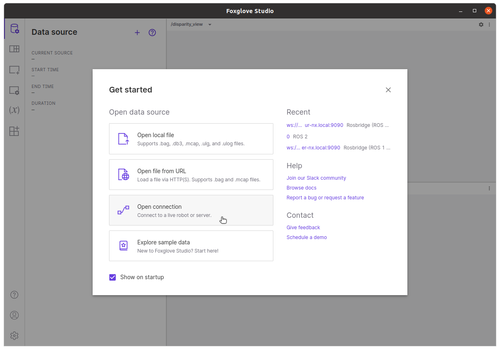
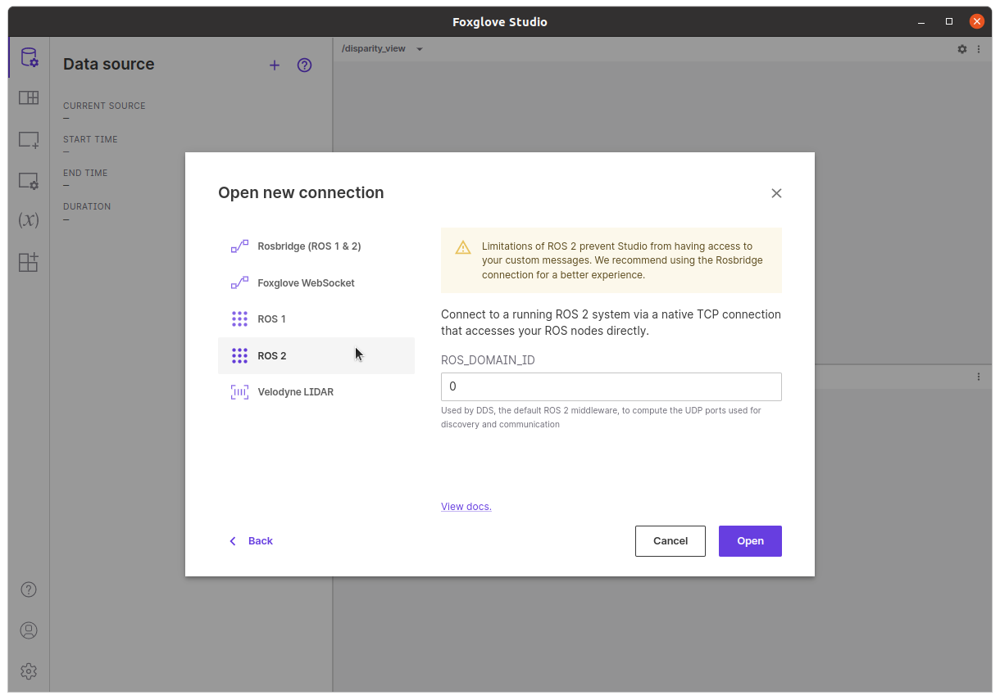
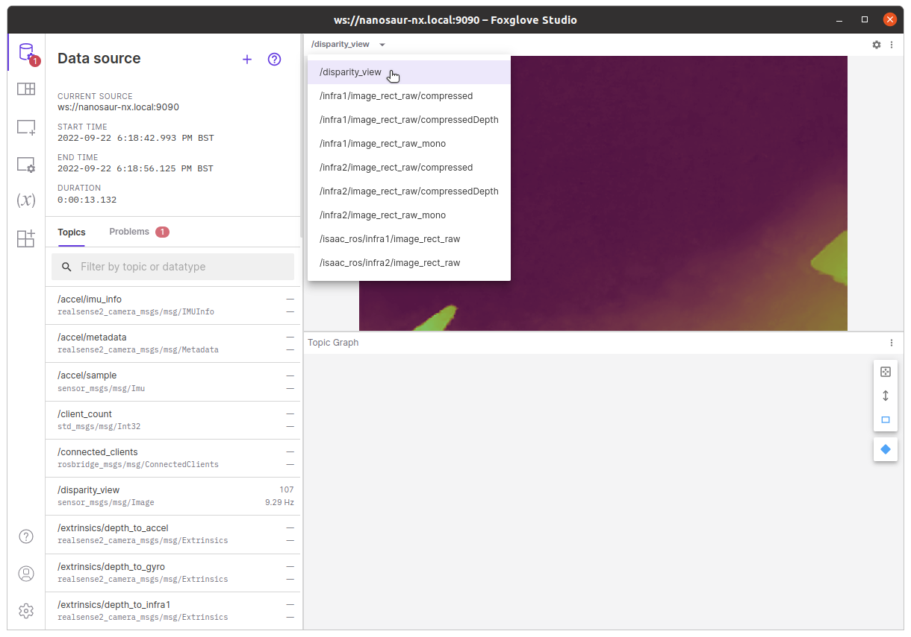
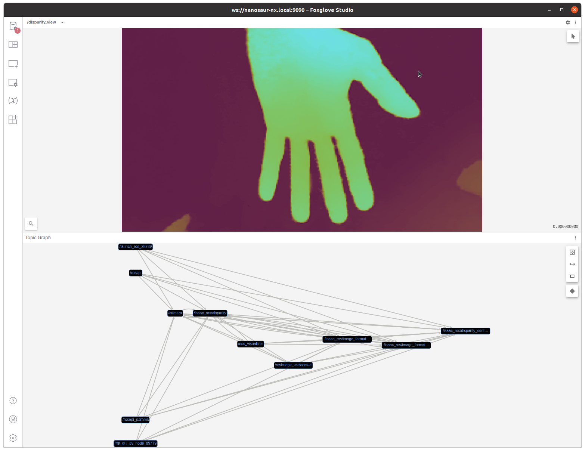
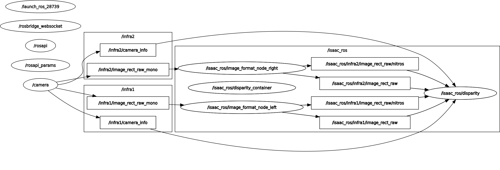

# isaac_roscon_demo

Demo docker for ROScon 2022

# Hardware required

1. NVIDIA Jetson Orin/Xavier
2. Jetpack 5.x.x
3. Realsense d435 (Other Realsenses should work, but I didn't test)
4. Display (connect to Jetson)
5. Keyboard (connect to Jetson)

# Install

There are two steps to follow, Install FoxGlove and Install Isaac ROS

## Foxglove

Download the latest [foxglove](https://foxglove.dev/download) version for ARM64

```
sudo apt install ./foxglove-studio-*.deb
sudo apt update
sudo apt install -y foxglove-studio
```

## Fix realsense udev

```
cd $HOME
git clone https://github.com/IntelRealSense/librealsense.git
sudo cp librealsense/config/99-realsense-libusb.rules /etc/udev/rules.d/
sudo udevadm control --reload-rules && udevadm trigger
```

After install the udev rules unplug and plug your realsense

## Isaac ROS

Install essential software on host

```
sudo apt install -y git-lfs python3-vcstool
mkdir -p $HOME/isaac_ros-dev/ros_ws/src
cd $HOME/isaac_ros-dev/ros_ws/src
git clone https://github.com/NVIDIA-ISAAC-ROS/isaac_ros_common.git
git clone https://github.com/rbonghi/isaac_roscon_demo.git
```

Make workspace folder and pull all packages

```
cd $HOME/isaac_ros-dev/ros_ws
# wget -L https://raw.githubusercontent.com/rbonghi/isaac_roscon_demo/main/demo.rosinstall -o demo.rosinstall
cp src/isaac_roscon_demo/demo.rosinstall demo.rosinstall
vcs import src < demo.rosinstall
vcs pull src
```

Config Isaac ROS common to build realsense example image

```
cd $HOME/isaac_ros-dev/ros_ws/src/isaac_ros_common
cp docker/realsense-dockerfile-example/.isaac_ros_common-config scripts/
```

Build and run docker image

```
cd $HOME/isaac_ros-dev/ros_ws/src/isaac_ros_common
bash scripts/run_dev.sh $HOME/isaac_ros-dev/ros_ws
```

# Docker

From this stage you work mainly from the docker container, if your are not on your docker container watch the installation above

## Build ROS2 packages

Run from docker container

```
colcon build --symlink-install --merge-install
```

## Convert model

Following [isaac_ros_dnn_stereo_disparity](https://github.com/NVIDIA-ISAAC-ROS/isaac_ros_dnn_stereo_disparity) convert the DNN stereo disparity model

```
/opt/nvidia/tao/tao-converter -k ess -t fp16 -e /workspaces/isaac_ros-dev/src/isaac_ros_dnn_stereo_disparity/resources/ess.engine -o output_left /workspaces/isaac_ros-dev/src/isaac_ros_dnn_stereo_disparity/resources/ess.etlt
```

## Run

Launch script from docker container

```
source install/setup.bash
ros2 launch isaac_roscon_demo demo.launch.py
```

# Setup foxglove

1. Open foxglove
2. Set up **Open connection**




3. Select **ROS2** and **Open**



4. Select `/disparity_view`



5. Final output



# How it is works



# Troubleshooting

If when you run the script `scripts/run_dev.sh` you read this error

```
docker: Error response from daemon: Conflict. The container name "/isaac_ros_dev-aarch64-container" is already in use by container "c9138a240269375558c2e7586e69bc41b6b40e478b29b1fb8ca53af781fea0dc". You have to remove (or rename) that container to be able to reuse that name.
See 'docker run --help'.
~/isaac_ros-dev/ros_ws/src/isaac_ros_common
```

run

```
docker system prune
```